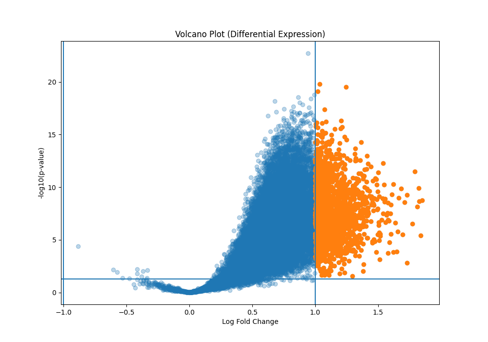
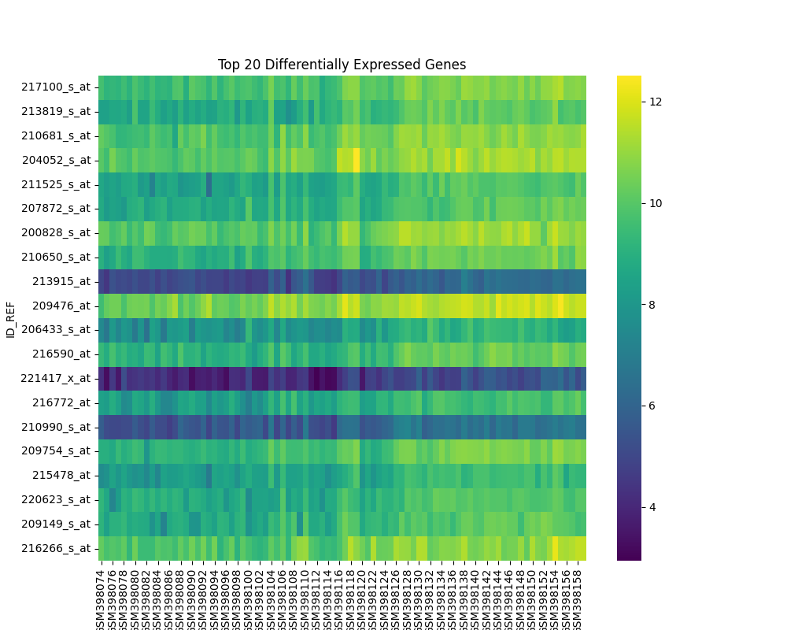

#  Gene Expression Profiling using Python

##  Overview

This project performs **differential gene expression analysis** to identify genes that are significantly upregulated or downregulated between two biological conditions.

The workflow simulates a typical RNA-seq analysis pipeline using processed gene expression data.

---

##  Dataset

* Source: NCBI Gene Expression Omnibus (GEO)
* Dataset ID: GSE15852
* Type: Microarray / Gene expression matrix

---

##  Methods

### 1. Data Preprocessing

* Loaded gene expression matrix
* Removed metadata rows
* Applied **log2 transformation**

### 2. Sample Grouping

* Samples divided into:

  * Normal
  * Cancer
    *(Note: grouping was simulated for demonstration purposes)*

### 3. Differential Expression Analysis

* Computed **Log Fold Change (logFC)**
* Performed **t-test**
* Applied **False Discovery Rate (FDR)** correction

### 4. Visualization

* Volcano Plot
* Heatmap of top genes
* Clustered heatmap

---

##  Results

###  Volcano Plot



### 🌡️ Heatmap



---

##  Key Insights

* Identified significantly differentially expressed genes
* Observed distinct expression patterns between conditions

---

##  Tech Stack

* Python (pandas, numpy, scipy)
* Visualization (matplotlib, seaborn)

---

##  How to Run

```bash
git clone <https://github.com/Khushboo847/Gene-Expression-Profiling>
cd gene-expression-project
pip install -r requirements.txt
python src/analysis.py
```

---

##  Disclaimer

This project is for educational purposes. Sample grouping was simulated due to limited metadata availability.

---

##  Author

Khushboo Chaudhary
